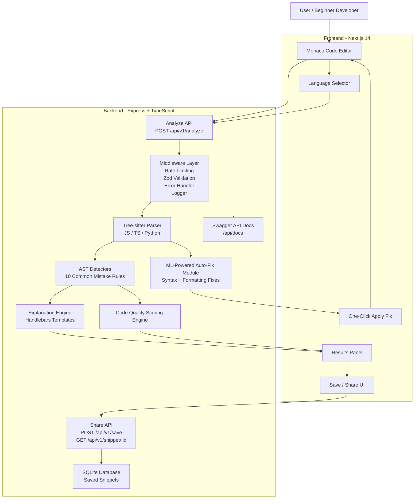

# 🔍 RookieMistakes.dev

**RookieMistakes.dev** is an open-source code analysis and beginner-friendly debugging platform that helps junior developers find, understand, and fix common programming mistakes in **JavaScript, TypeScript, and Python**.

The platform combines two complementary systems:

1. **Deterministic AST-based analysis** for explainable mistake detection.
2. **Machine Learning-powered auto-fix assistance** for common beginner syntax and formatting errors.

Instead of only showing compiler errors, RookieMistakes.dev explains *why* the mistake happened, highlights the relevant code location, suggests a fix, and gives a **code quality score** that encourages better programming habits.

---

## ✨ Key Features

- **AST-Based Mistake Detection**  
  Uses Tree-sitter syntax trees to detect common beginner mistakes through deterministic pattern matching.

- **10 Common Mistake Detectors**  
  Detects issues such as missing `await`, use of `==` instead of `===`, nullable access, empty catch blocks, variable shadowing, off-by-one loops, and more.

- **Machine Learning-Powered Auto-Fix Module**  
  Detects and fixes common beginner syntax and formatting issues such as:
  - Missing brackets
  - Unmatched parentheses
  - Missing semicolons
  - Incorrect Python indentation
  - Basic formatting inconsistencies

- **One-Click Apply Fix**  
  Users can automatically apply suggested fixes for supported issues, reducing debugging time and improving code correctness.

- **Suggested Fix for Every Mistake**  
  Each detected issue includes a clear explanation and a practical fix suggestion.

- **Code Quality Score**  
  Generates a score based on detected mistakes, severity, and code quality signals to encourage better programming habits.

- **Three-Language Support**  
  Supports JavaScript, TypeScript, and Python.

- **Explainable Results**  
  Each result includes concrete AST facts, severity, line number, column number, explanation, and fix guidance.

- **Monaco Editor Integration**  
  Provides a professional browser-based coding experience with syntax highlighting.

- **Save and Share Results**  
  Users can save analyzed snippets and share them through unique URLs.

- **Interactive API Documentation**  
  Swagger UI is available at `/api/docs`.

- **Production-Oriented Backend Practices**  
  Includes input validation, rate limiting, structured logging, error handling, tests, Docker support, and CI/CD workflow.

- **Open Source and Self-Hostable**  
  Built without paid APIs. The project can be run locally using Docker or standard Node.js tooling.

---

## 🎯 Problem Statement

Beginner developers often struggle with small but frustrating mistakes: missing `await`, using loose equality, forgetting brackets, leaving empty `catch` blocks, writing incorrect Python indentation, or misunderstanding nullable values.

Traditional compiler and runtime errors often tell users *what failed*, but not always *why it is wrong* or *how to think about the fix*.

**RookieMistakes.dev solves this by acting like a beginner-focused code review assistant.**

It detects common junior developer mistakes, explains them in simple language, suggests a fix, and helps users learn better programming habits through repeated feedback.

---

## 🧠 How It Works

RookieMistakes.dev uses a hybrid analysis pipeline:

1. The user writes or pastes code into the Monaco editor.
2. The frontend sends the code and selected language to the backend.
3. The backend validates the input.
4. Tree-sitter parses the code into an Abstract Syntax Tree.
5. Deterministic detectors inspect the AST for known mistake patterns.
6. The explanation engine generates beginner-friendly explanations and suggested fixes.
7. The ML-powered auto-fix module checks for supported syntax and formatting issues.
8. The scoring engine calculates a code quality score.
9. Results are returned to the frontend with mistake details, explanations, suggested fixes, and fix actions.
10. The user can apply supported fixes using the one-click **Apply Fix** feature.

This design keeps the platform explainable while still providing practical automated repair assistance.

---

## 🏗️ System Architecture



---

## 🧩 Core Modules

### 1. Frontend

The frontend is built with **Next.js 14**, **TypeScript**, and **Tailwind CSS**.

Responsibilities:

- Provides the browser-based code editor.
- Allows users to select a language.
- Sends code to the backend analysis API.
- Displays mistakes, explanations, severity, line numbers, and suggested fixes.
- Supports one-click application of auto-fixes.
- Allows users to save and share analyzed code snippets.

---

### 2. Backend API

The backend is built with **Express** and **TypeScript**.

Responsibilities:

- Handles code analysis requests.
- Validates input using Zod.
- Applies rate limiting to prevent abuse.
- Parses code using Tree-sitter.
- Runs deterministic mistake detectors.
- Calls the explanation engine.
- Runs the auto-fix module for supported issues.
- Calculates the code quality score.
- Stores shared snippets in SQLite.
- Serves Swagger API documentation.

---

### 3. AST-Based Analysis Engine

The deterministic analysis engine uses **Tree-sitter** to parse code into syntax trees.

This makes the platform explainable because each result is based on concrete syntax tree facts such as:

- Node type
- Function scope
- Parent node
- Line and column
- Variable declarations
- Call expressions
- Loop boundaries
- Error-handling blocks

This approach is more reliable than simple regex-based scanning and easier to explain than a black-box model.

---

### 4. Machine Learning-Powered Auto-Fix Module

In addition to the compiler-style analysis engine, RookieMistakes.dev includes a **Machine Learning-Powered Auto-Fix Module** trained on common beginner programming errors and their corrected versions.

The module focuses on common beginner mistakes such as:

| Error Type | Example |
|-----------|---------|
| Missing brackets | `if (x > 0 {` |
| Unmatched parentheses | `print("hello"` |
| Missing semicolons | `const x = 5` |
| Python indentation errors | Incorrect spacing inside `if`, `for`, `while`, or function blocks |
| Basic formatting issues | Inconsistent spacing or malformed simple statements |

The auto-fix system is designed for practical repair assistance, not blind code rewriting. It targets small, high-confidence fixes that help beginners quickly move forward.

Users can review and apply supported fixes through a one-click **Apply Fix** action.

---

### 5. Explanation Engine

Each detector returns structured facts about the issue. The explanation engine converts those facts into beginner-friendly feedback using templates.

Each mistake includes:

- Mistake name
- Severity
- Line and column
- Human-readable message
- AST facts
- Explanation
- Suggested fix
- Auto-fix availability when supported

---

### 6. Code Quality Scoring Engine

RookieMistakes.dev calculates a code quality score based on the number and severity of detected mistakes.

The score helps beginners understand the overall health of their code and encourages better programming habits.

Example scoring idea:

| Severity | Impact |
|---------|--------|
| Error | High score penalty |
| Warning | Medium score penalty |
| Info | Low score penalty |

The goal is not to shame users, but to provide a clear improvement signal.

---

## 🛠️ Tech Stack

| Component | Technology |
|-----------|------------|
| Frontend | Next.js 14, TypeScript, Tailwind CSS |
| Editor | Monaco Editor |
| Backend | Node.js, Express, TypeScript |
| Parser | web-tree-sitter |
| Languages | JavaScript, TypeScript, Python |
| Auto-Fix | ML-powered beginner error correction module |
| Database | SQLite using sql.js |
| Templates | Handlebars |
| Validation | Zod |
| Logging | Winston |
| Rate Limiting | express-rate-limit |
| API Docs | Swagger |
| Testing | Jest, Supertest, React Testing Library |
| Linting | ESLint, Prettier |
| CI/CD | GitHub Actions |
| Containerization | Docker, Docker Compose |

---

## 🚀 Quickstart

### Option 1: Docker

```bash
git clone https://github.com/rookiemistakes/rookiemistakes.dev.git
cd rookiemistakes.dev

docker-compose up --build
```

Open the app:

```text
Frontend: http://localhost:3000
Backend API: http://localhost:3001
API Docs: http://localhost:3001/api/docs
```

---

### Option 2: Local Development

Start the backend:

```bash
cd backend
cp .env.example .env
npm install
npm run dev
```

Start the frontend in another terminal:

```bash
cd frontend
npm install
npm run dev
```

Open:

```text
Frontend: http://localhost:3000
Backend API: http://localhost:3001
API Docs: http://localhost:3001/api/docs
```

---

## 🧪 Running Tests

```bash
cd backend
npm test
```

```bash
cd frontend
npm test
```

Run linting:

```bash
cd backend
npm run lint
```

```bash
cd frontend
npm run lint
```

---

## 📡 API Reference

Interactive API documentation is available at:

```text
/api/docs
```

---

### Analyze Code

```http
POST /api/v1/analyze
```

Analyzes code for beginner mistakes and returns explanations, suggested fixes, auto-fix metadata, and code quality score.

#### Request

```bash
curl -X POST http://localhost:3001/api/v1/analyze \
  -H "Content-Type: application/json" \
  -d '{
    "code": "async function test() { fetch(\"/api\"); }",
    "language": "javascript"
  }'
```

#### Example Response

```json
{
  "mistakes": [
    {
      "id": 1,
      "name": "missing_await",
      "line": 1,
      "column": 24,
      "severity": "error",
      "message": "Async function 'fetch' called without await",
      "ast_facts": {
        "callee_name": "fetch",
        "enclosing_function_is_async": true,
        "parent_type": "expression_statement"
      },
      "explanation": "You call fetch inside an async function without awaiting it. Because async functions return Promises, the surrounding code continues before the operation completes.",
      "suggested_fix": "Await the call or handle the Promise with .then().",
      "auto_fixable": true
    }
  ],
  "autoFixes": [
    {
      "type": "missing_await",
      "line": 1,
      "description": "Insert await before fetch call.",
      "confidence": 0.92
    }
  ],
  "score": 8.7
}
```

---

### Save Analysis Result

```http
POST /api/v1/save
```

Saves code and analysis results for sharing.

#### Request

```bash
curl -X POST http://localhost:3001/api/v1/save \
  -H "Content-Type: application/json" \
  -d '{
    "code": "var x = 1;",
    "language": "javascript",
    "results": {
      "mistakes": [],
      "score": 9.5
    }
  }'
```

#### Response

```json
{
  "id": "abc123xyz"
}
```

---

### Retrieve Shared Snippet

```http
GET /api/v1/snippet/:id
```

Retrieves a saved code snippet and its previous analysis result.

#### Request

```bash
curl http://localhost:3001/api/v1/snippet/abc123xyz
```

#### Response

```json
{
  "id": "abc123xyz",
  "code": "var x = 1;",
  "language": "javascript",
  "results": {
    "mistakes": [],
    "score": 9.5
  },
  "created_at": "2026-06-06T10:30:00.000Z"
}
```

---

## 🔎 The 10 Detectors

| Detector | Languages | Severity | Description |
|----------|-----------|----------|-------------|
| `missing_await` | JS / TS | Error | Async function called without `await` |
| `double_equals` | JS / TS | Warning | Uses `==` or `!=` instead of `===` or `!==` |
| `nullable_access` | JS / TS / Python | Warning | Possible access on `null`, `undefined`, or `None` |
| `variable_shadowing` | JS / TS / Python | Warning | Inner variable shadows an outer variable |
| `off_by_one_loop` | JS / TS / Python | Warning | Loop may access one item beyond the collection length |
| `no_error_handling` | JS / TS / Python | Warning | Async operation is used without error handling |
| `array_mutation` | JS / TS | Warning | Array is mutated directly, which may be risky in state-based code |
| `var_usage` | JS | Info | Uses `var` instead of `let` or `const` |
| `console_log_left` | JS / TS | Info | Console statements left in code |
| `empty_catch` | JS / TS / Python | Warning | Catch or except block is empty |

---

## 🧠 Example Use Case

A beginner writes:

```javascript
async function loadUser() {
  fetch("/api/user");
}
```

RookieMistakes.dev detects:

```text
Mistake: missing_await
Severity: error
Line: 2
Issue: fetch() is called inside an async function without await.
Suggested fix: Use await fetch("/api/user") or handle the Promise with .then().
```

Improved version:

```javascript
async function loadUser() {
  await fetch("/api/user");
}
```

The user learns both the fix and the reasoning behind it.

---

## 📁 Project Structure

```text
rookie-mistakes/
├── frontend/
│   ├── package.json
│   ├── next.config.js
│   ├── tailwind.config.js
│   ├── Dockerfile
│   └── src/
│       ├── app/
│       │   ├── layout.tsx
│       │   ├── page.tsx
│       │   └── s/[id]/page.tsx
│       ├── components/
│       │   ├── Editor.tsx
│       │   ├── ResultsPanel.tsx
│       │   └── ApplyFixButton.tsx
│       └── lib/
│           └── api.ts
├── backend/
│   ├── package.json
│   ├── tsconfig.json
│   ├── jest.config.js
│   ├── Dockerfile
│   └── src/
│       ├── index.ts
│       ├── config.ts
│       ├── parser.ts
│       ├── db.ts
│       ├── lib/
│       ├── middleware/
│       ├── routes/
│       ├── routes/v1/
│       ├── detectors/
│       ├── explainers/
│       ├── autofix/
│       ├── scoring/
│       └── swagger.ts
├── backend/tests/
├── backend/fixtures/
├── docker-compose.yml
├── README.md
└── LICENSE
```

---

## ➕ Adding a New Detector

Create a detector file:

```typescript
// backend/src/detectors/my-detector.ts
import { Parser } from '../parser';
import { DetectorResult, Language } from '../types';
import { walkTree } from '../parser';

export function detectMyIssue(
  tree: Parser.Tree,
  code: string,
  language: Language
): DetectorResult[] {
  const results: DetectorResult[] = [];

  walkTree(tree.rootNode, (node) => {
    if (node.type === 'some_pattern') {
      results.push({
        name: 'my_issue',
        line: node.startPosition.row + 1,
        column: node.startPosition.column + 1,
        severity: 'warning',
        message: 'Description of the issue',
        ast_facts: {
          node_type: node.type
        }
      });
    }
  });

  return results;
}
```

Register the detector:

```typescript
import { detectMyIssue } from './my-detector';

export const detectors = [
  // existing detectors
  detectMyIssue
];
```

Add an explanation template:

```typescript
export const templates = {
  my_issue: {
    explanation: 'This pattern can create a beginner-level bug because {{node_type}} is being used incorrectly.',
    fix: 'Rewrite this section using the safer recommended pattern.'
  }
};
```

Add tests:

```text
backend/tests/detectors/my-detector.test.ts
```

---

## 🧱 Assumptions and Tradeoffs

### Assumptions

1. **Single-file analysis**  
   The platform analyzes one file at a time and does not resolve full project dependencies.

2. **Syntax-first detection**  
   Most detectors use AST patterns rather than full type inference or runtime execution.

3. **Beginner-focused auto-fix**  
   The auto-fix module targets simple, high-confidence fixes instead of complex refactoring.

4. **Public snippet sharing**  
   Saved snippets are accessible through unique URLs.

---

### Tradeoffs

1. **Explainability over deep static analysis**  
   The platform focuses on understandable beginner feedback instead of advanced compiler-level analysis.

2. **High-confidence fixes over aggressive rewriting**  
   Auto-fix is intentionally limited to simple, common mistakes to avoid unsafe edits.

3. **SQLite for simplicity**  
   SQLite keeps the project easy to run locally, but PostgreSQL would be better for high-concurrency production use.

4. **No authentication by default**  
   This keeps the MVP simple, but authentication should be added before storing private user code in production.

---

## 🛣️ Future Improvements

- Add more detectors for beginner logic errors.
- Add TypeScript type-checker integration for deeper analysis.
- Add support for Java and C++ beginner mistakes.
- Add user accounts and private snippet storage.
- Add GitHub repository analysis.
- Add before/after fix previews.
- Add teacher dashboard for classrooms or coding bootcamps.
- Add PostgreSQL support for production deployment.
- Add more robust model evaluation for the auto-fix module.

---

## 🏆 Why This Project Matters

RookieMistakes.dev is not just a syntax checker. It is a learning-focused code review tool for beginner developers.

It combines:

- Static analysis
- AST parsing
- Explainable feedback
- Code quality scoring
- Machine learning-based auto-fix support
- Shareable analysis results
- Production-style backend engineering

This makes it useful as both a developer tool and a strong full-stack internship project because it demonstrates frontend engineering, backend API design, static analysis, ML-assisted tooling, database usage, testing, documentation, and deployment readiness.

---

## 📄 License

MIT License. See [LICENSE](LICENSE) for details.

---

Built with ❤️ to help junior developers learn from mistakes, fix code faster, and build better programming habits.
